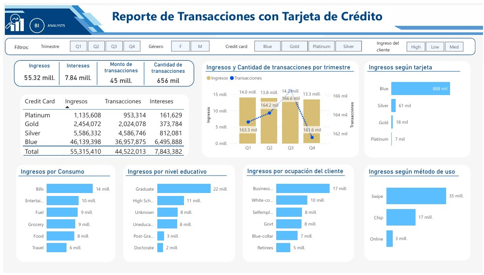
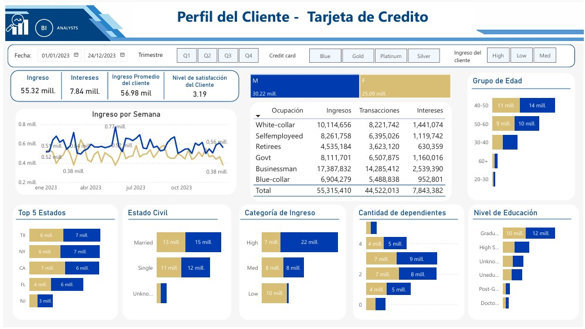
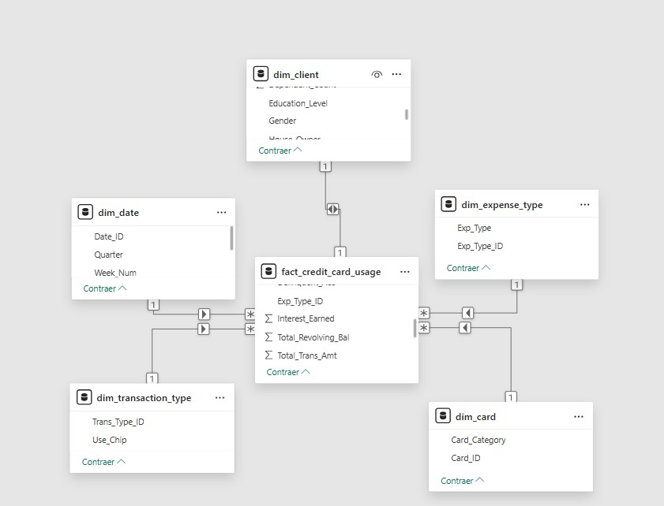

# Credit Card – Análisis con Power BI
## Dashboards

### 🧾 Reporte de Transacciones

### 👤 Perfil del Cliente

Este proyecto desarrolla un sistema de visualización analítica sobre el uso de tarjetas de crédito, con enfoque en patrones de comportamiento de clientes, consumo por segmentos y desempeño de productos financieros. Está construido con Power BI y un modelo dimensional en esquema estrella.

## Tecnologías y Metodología

### Herramientas Utilizadas
- **SQL Server**: Carga de datos (`BULK INSERT`), validación y transformación.
  - Principales operaciones realizadas:
    - Uso de `COUNT(DISTINCT)` para contar clientes únicos.
    - Consultas con `GROUP BY`, `COUNT()` y `SUM()` para analizar transacciones por tipo de tarjeta y por semana.
    - Carga de archivos CSV mediante `BULK INSERT` en las tablas de staging (`cust_detail` y `cc_detail`).
    - Uso de `JOIN` para combinar información de clientes y transacciones.
    - **Creación de claves primarias y foráneas** para establecer relaciones en el modelo en estrella entre la tabla de hechos y las dimensiones.
    - **Consulta el script completo en el archivo**: `CreditCard.sql`
- **Power BI**: Visualización y análisis de datos.
  DAX utlizadas
  - Clasificación por Grupo de Edad
    - `AgeGroup = 
  SWITCH(
      TRUE(),
      'dim_client'[Customer_Age] < 30, "20-30",
      'dim_client'[Customer_Age] >= 30 && 'dim_client'[Customer_Age] < 40, "30-40",
      'dim_client'[Customer_Age] >= 40 && 'dim_client'[Customer_Age] < 50, "40-50",
      'dim_client'[Customer_Age] >= 50 && 'dim_client'[Customer_Age] < 60, "50-60",
      'dim_client'[Customer_Age] >= 60, "60+",
      "Desconocido"
  )`
  - Clasificación por Categoría de Ingreso
    - `IncomeGroup = SWITCH(
      TRUE(),
      'dim_client'[Income] < 35000, "Low",
      'dim_client'[Income] < 70000, "Med",
      'dim_client'[Income] >= 70000, "High",
      "unknown"
  )`
  - Número de semana
    - `Week_Num2 = WEEKNUM('dim_date'[Week_Start_Date])`
  - Ingreso total
    - `Revenue = SUMX(
        'fact_credit_card_usage',
        'fact_credit_card_usage'[Annual_Fees] +
        'fact_credit_card_usage'[Total_Trans_Amt] +
        'fact_credit_card_usage'[Interest_Earned]
    )`
### Estructura del Modelo
**Modelo Dimensional**: Esquema estrella con 5 dimensiones y 1 tabla de hechos.
- **Tablas de Dimensión**:
  - `dim_client` (clientes)
  - `dim_date` (fechas)
  - `dim_card` (categoría tarjeta)
  - `dim_transaction_type` (tipo de transacción)
  - `dim_expense_type` (tipo de gasto)
- **Tabla de Hechos**:
  - `fact_credit_card_usage` con métricas como:
    - Monto de transacciones
    - Tasas de utilización
    - Intereses generados
    - Comisiones y uso semanal

##  Resultados 

| Indicador                         | Valor             |
|----------------------------------|-------------------|
| Ingreso Bruto total                    | 55.32 millones    |
| Intereses generados              | 7.84 millones     |
| Monto total de transacciones     | 45 millones       |
| Cantidad total de transacciones  | 656 mil           |
| Tarjeta dominante                | Blue Card (83% ingresos) |
| Método de uso más rentable       | Swipe (35 millones) |
| Nivel educativo más rentable     | Graduate (22 millones) |
| Grupo etario con más ingresos    | 40-50 años        |
| Estado civil predominante        | Married (28 millones) |
| Satisfacción promedio del cliente| 3.19 / 5          |

## Indicadores 

###  Perfil de Cliente Rentable
- Género: Masculino
- Edad: 40 a 50 años
- Educación: Universitaria (Graduate)
- Ocupación: Empresarios (Businessman) y trabajadores de oficina (White-collar)
- Estado civil: Casado
- Ingreso del cliente: Alto

###  Productos y Uso
- La **tarjeta Blue** concentra la mayoría de ingresos, transacciones e intereses.
- El **método Swipe** supera ampliamente a Chip y Online.
- El **gasto en servicios (Bills)** representa la mayor proporción de consumo.
- El ingreso presenta picos semanales (0.77 millones), especialmente en julio.

###  Geografía y Educación
- Estados líderes en ingresos: **Texas, Nueva York y California**.
- Clientes con nivel de educación superior generan más del 50% de los ingresos.
- La categoría `Retirees` y `Govt` tienen menor volumen en comparación.

##  Recomendaciones Estratégicas

### 1. Ampliación de la Oferta de Productos
- Existe una alta dependencia de la tarjeta **Blue**.
- Se recomienda incentivar productos Silver, Gold y Platinum mediante campañas con beneficios exclusivos y promociones.

### 2.  Segmentación y Campañas Dirigidas
- **Target prioritario**:
  - Edad: 40-50 años
  - Educación: Universitaria
  - Ingreso del cliente: Alto
- Se recomienda diseñar campañas personalizadas con beneficios financieros y experiencias exclusivas.

### 3.  Mejora en Experiencia del Cliente
- Los clientes presentan un nivel de satisfacción promedio de 3.19 sobre 5, lo que indica una percepción positiva general. Esto podria ser un indicaador con una base sólida para implementar estrategias de retención y fidelización, especialmente si se complementa con mejoras específicas en los puntos de contacto con el cliente.
- Reforzar la atención personalizada y beneficios exclusivos por categoría de tarjeta podría elevar aún más esta percepción positiva.

### 4.  Optimización de Métodos de Pago
-  `Swipe` representa más del 60% de ingresos con esto en cuenta se recomienda mantener este canal promocionado e incentivar el uso del método `Chip` con beneficios, para mejorar cobertura y seguridad.

### 5.  Estrategia Geográfica
- Se observa que los estados de TX, NY y CA concentran la mayoría de los ingresos por tanto se recomienda focalizar esfuerzos comerciales y publicitarios en estos estados con estrategias regionales.

##  Cómo abrir el archivo

1. Abre Power BI Desktop.
2. Carga el archivo `CreditCard.pbix` incluido en este repositorio.
3. Explora el dashboard y ajusta los filtros para visualizar diferentes perspectivas del negocio.
